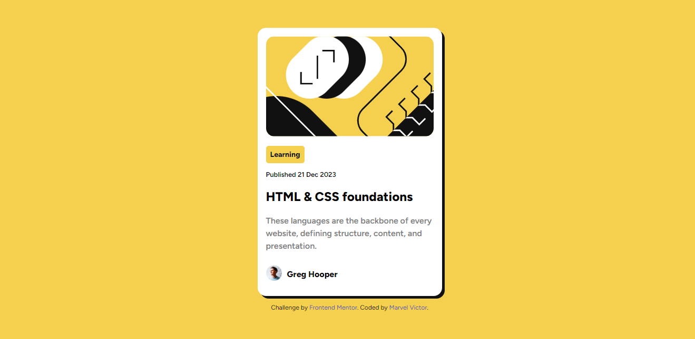
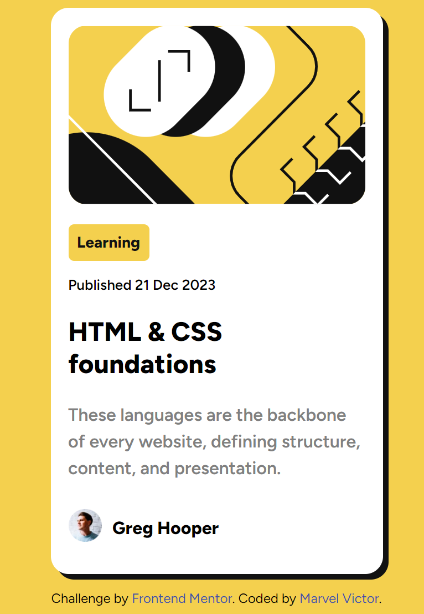

# Frontend Mentor - Blog preview card solution

This is a solution to the [Blog preview card challenge on Frontend Mentor](https://www.frontendmentor.io/challenges/blog-preview-card-ckPaj01IcS). Frontend Mentor challenges help you improve your coding skills by building realistic projects. 

## Table of contents

- [Overview](#overview)
  - [The challenge](#the-challenge)
  - [Screenshot](#screenshot)
  - [Links](#links)
- [My process](#my-process)
  - [Built with](#built-with)
- [Author](#author)

## Overview

### The challenge

Users should be able to:

- See hover and focus states for all interactive elements on the page

### Screenshot

- Desktop View

- Mobile View

### Links

- Frontend Mentor Solution URL: [Frontend Mentor Solution Page](https://www.frontendmentor.io/solutions/)

- Github Solution URL: [Github Hosted Codes](https://github.com/Mharvel13/Blog-Preview-Card)

- Live Site URL: [Live site URL ](https://mharvel13.github.io/Blog-Preview-Card/)

## My process

### Built with

- Semantic HTML5 markup
- CSS custom properties
- Flexbox

## Author

- GitHub Profile - [Mharvel13](https://github.com/Mharvel13)
- Frontend Mentor - [Marvel Victor](https://www.frontendmentor.io/profile/Mharvel13)
- Twitter - [Marvel](https://twitter.com/Mharvel_O)
